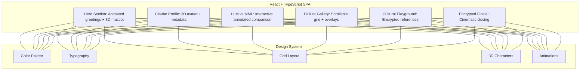

# prompt.FaiL — Comprehensive Design Specification

---

## Branding Guidelines

- **Tone:** Playful, witty, clever, with sharp British humor
- **Core Themes:** AI quirks, failures, contrasts, cultural layers
- **Visual Identity:**  
  - Inspired by Mondrian's geometric abstraction  
  - Bright primaries (red, yellow, blue) with black, white, pink, pastel accents  
  - Playful voxel/3D characters throughout  
  - Clean, minimalist typography  
  - Layered encrypted elements for intrigue

---

## Color Palette

| Color Name       | Hex        | Usage                                         |
|------------------|------------|-----------------------------------------------|
| Primary Red      |rgb(255, 128, 54)    | Highlights, CTA, witty captions               |
| Primary Yellow   |rgb(255, 237, 44)    | Background blocks, accents                    |
| Primary Blue     |rgb(77, 67, 255)    | Interactive elements, overlays                |
| Accent Pink      |rgb(255, 210, 182)    | Playful highlights, character details         |
| Accent LightBlue |rgb(176, 182, 230)    | Backgrounds, soft overlays                    |
| Black            | #000000    | Text, grid lines, contrast                    |
| White            | #FFFFFF    | Background, text, whitespace                  |
| Dark Charcoal    | #222222    | Dark mode backgrounds                        |

---

## Typography

- **Primary Font:** Inter, Helvetica, or Space Grotesk
- **Headers:** Bold, uppercase or title case
- **Body:** Clean, legible sans-serif
- **Captions:** Italicized witty remarks
- **Animated Text:** For greetings, calls-to-action, witty substitutions

---

## Visual Design Elements

- **Mondrian-Inspired Grid:**  
  Modular, geometric layout with bold color blocks and black grid lines  
  Adaptive grid rearrangements for responsiveness

- **3D Characters:**  
  Playful voxel-style mascots and icons  
  Context-aware animations (idle, reactions, transitions)  
  Lightweight formats (Lottie, SVG, optimized GLTF)

- **Animations:**  
  Framer Motion for smooth UI transitions  
  Lottie for complex vector animations  
  CSS keyframes for subtle background effects  
  Animated text substitutions and hover effects

- **Encrypted Layers:**  
  Hidden cultural references in grid tiles  
  Hover/click reveals with subtle animations  
  Layered overlays for intrigue

- **Accessibility:**  
  High contrast ratios  
  Keyboard navigable  
  Alt text for all imagery  
  Skip animations option

---

## User Experience Principles

- **Immersive, scroll-driven journey** with flawless snap transitions
- **Deep linking** to all sections with smooth routing
- **Instant engagement** via animated witty hero section
- **Playful exploration** with hidden encrypted content
- **Clear hierarchy** via grid layout and typography
- **Fast, responsive, and accessible** on all devices
- **Consistent witty tone** throughout

---

## System Architecture Overview

---

## Design Rationale

- **Mondrian grid** provides a modular, adaptable, visually striking foundation
- **3D characters** add personality, humor, and engagement
- **Animations** enhance immersion without overwhelming
- **Encrypted layers** reward exploration and add depth
- **Witty tone** differentiates the experience
- **Responsiveness and accessibility** ensure inclusivity
- **Modularity** supports scalability and maintainability

---

## Technical Specifications

Based on recent codebase improvements, the following technical specifications have been updated:

- **Frontend Refactoring:** The large `ClaubeDesign.tsx` component has been broken down into smaller, more manageable and reusable components.
- **Secure Secret Management:** Implementation now strictly adheres to using environment variables for sensitive data, removing hardcoded secrets.
- **Database Migrations:** Database schema changes are now managed via Umzug/sequelize-cli migrations, replacing `sequelize.sync()` for production safety.

---

## Technical Specifications

- **Routing:** react-router-dom with scroll sync
- **Animations:** Framer Motion, Lottie, CSS
- **3D Assets:** Optimized voxel models, SVGs, or lightweight GLTF
- **Styling:** CSS Grid + Flexbox, CSS Variables, media queries
- **Performance:** Lazy load assets, optimize images/animations
- **Security:** No hardcoded secrets, environment variables, secret scanning
- **Testing:** 100% coverage with Jest + React Testing Library
- **Accessibility:** WCAG compliance, keyboard navigation, alt text
- **Containerization:** Docker for consistent environments
- **CI/CD:** Automated pipelines with linting, testing, deployment
- **Monitoring:** Logging, analytics, performance metrics

---

## Summary

This design specification ensures a **unified, immersive, witty, and visually captivating AI experience** that is **technically robust, accessible, and scalable**.

All implementation must **strictly adhere** to these guidelines to maintain **brand integrity, user engagement, and technical excellence**.