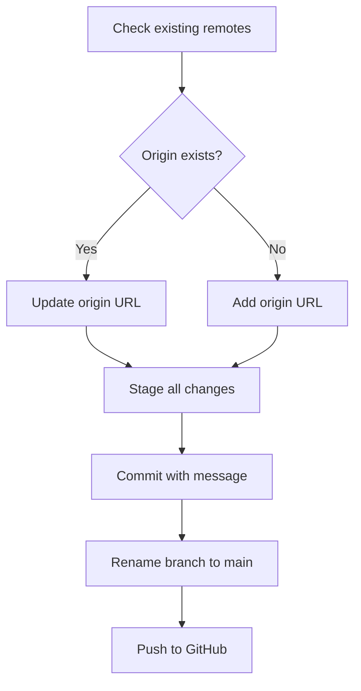

# Plan to Save and Push `prompt-fail` Project to GitHub

## Objective
Save the current state of the `/home/qubit/prompt-fail` project directory and push it to the GitHub repository:

**Repository URL:** `https://github.com/aegntic/prompt-fail`

---

## Step-by-Step Plan

### 1. Verify or Set Remote Repository
- **Check existing remotes:**
  ```
  git remote -v
  ```
- **If `origin` exists but points elsewhere:**
  ```
  git remote set-url origin https://github.com/aegntic/prompt-fail
  ```
- **If no `origin` remote exists:**
  ```
  git remote add origin https://github.com/aegntic/prompt-fail
  ```

### 2. Stage All Files
- Add all files and changes to staging:
  ```
  git add .
  ```

### 3. Commit Changes
- Commit with a descriptive message:
  ```
  git commit -m "Save current project state"
  ```
  *(If no changes staged, this will do nothing)*

### 4. Set Branch to `main`
- Rename current branch to `main` (if not already):
  ```
  git branch -M main
  ```

### 5. Push to GitHub
- Push the commit to the remote repository:
  ```
  git push -u origin main
  ```

---

## Mermaid Diagram of the Process



---

## Notes
- This plan assumes the `.git` repository is already initialized (confirmed).
- The commit message will be `"Save current project state"`.
- The branch to push is `main`.
- If pushing for the first time, GitHub may prompt for authentication (token/password).
- This plan should be executed from the `/home/qubit/prompt-fail` directory.

---

## Next Steps
- Switch to **code mode** to execute these steps.
- Verify push success on GitHub.