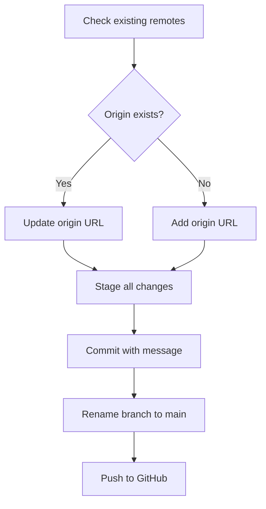

# Plan to Save and Push `prompt-fail` Project to GitHub

## Objective
Save the current state of the `/home/qubit/prompt-fail` project directory and push it to the GitHub repository:

**Repository URL:** `https://github.com/aegntic/prompt-fail`

---

## Step-by-Step Plan

### 1. Verify or Set Remote Repository
- **Check existing remotes:**
  ```
  git remote -v
  ```
- **If `origin` exists but points elsewhere:**
  ```
  git remote set-url origin https://github.com/aegntic/prompt-fail
  ```
- **If no `origin` remote exists:**
  ```
  git remote add origin https://github.com/aegntic/prompt-fail
  ```

### 2. Stage All Files
- Add all files and changes to staging:
  ```
  git add .
  ```

### 3. Commit Changes
- Commit with a descriptive message:
  ```
  git commit -m "Save current project state"
  ```
  *(If no changes staged, this will do nothing)*

### 4. Set Branch to `main`
- Rename current branch to `main` (if not already):
  ```
  git branch -M main
  ```

### 5. Push to GitHub
- Push the commit to the remote repository:
  ```
  git push -u origin main
  ```

---

## Mermaid Diagram of the Process



---

## Notes
- This plan assumes the `.git` repository is already initialized (confirmed).
- The commit message will be `"Save current project state"`.
- The branch to push is `main`.
- If pushing for the first time, GitHub may prompt for authentication (token/password).
- This plan should be executed from the `/home/qubit/prompt-fail` directory.

---

## Implemented Improvements (Post-Codebase Review)

Based on the recent comprehensive codebase review, the following significant improvements have been implemented:

- **Frontend Refactoring:** The `src/components/ClaubeDesign.tsx` component has been refactored into smaller, more modular components to improve readability, maintainability, and reusability.
- **Secure Secret Management:** Implemented secure practices for managing sensitive data, emphasizing the use of environment variables and the removal of hardcoded secrets and plain text files from the repository.
- **Database Migrations:** Replaced `sequelize.sync()` with a robust database migration system using Umzug and sequelize-cli. This ensures controlled and versioned database schema changes, particularly crucial for production environments. Instructions for running migrations in development and production, as well as generating new migration files, are detailed in the `README.md`.

## Next Steps
- Continue enhancing documentation, including adding inline comments to complex code sections.
- Update `DESIGN.md` and `TASK.md` to reflect the completed improvements.
- Address other identified improvement areas as per the codebase review report (excluding the canceled testing task).
- Save and push the project state to GitHub.
- Verify push success on GitHub.
---

## Plan: AI Service Reliability Leaderboard (Feature)

**Objective:** Replace placeholder data in `src/components/ReliabilityLeaderboard.tsx` with actual reliability metrics fetched via the existing backend for a comprehensive list of AI services, updated periodically.

**1. Research Data Sources:**
    *   **Target Services:** Grok (xAI), ChatGPT (OpenAI), Gemini (Google AI), Claude (Anthropic), OpenRouter, Hugging Face, Stable Diffusion (Stability AI / Community), Leonardo.ai, Recraft, Sora (OpenAI), Luma Labs, Canva, Adobe Firefly, Kling.ai, RunwayML, Blackforest Labs, Smithery, Databutton, Windsurf, Roocode, Cline, Groq, Llama (Meta AI), DeepSeek, Mistral AI.
    *   **Method:** Investigate official status pages, public APIs, third-party aggregators, and community resources.
    *   **Output:** Documented mapping of service to data source (type, accessibility).

**2. Evaluate Feasibility & Define Metrics:**
    *   Assess source reliability (APIs > scraping). Identify services lacking viable sources.
    *   **Primary Metric:** Binary "Operational" / "Disrupted" / "Unknown".
    *   **Secondary Metrics (If Available):** Recent Incident Count, Current Status Description.

**3. Architecture: Option B - Existing Backend API Endpoint (Node.js/Express)**
    *   Leverage the current Express application (`backend/src/server.ts`).
    *   Add a new API endpoint: `GET /api/reliability-status`.
    *   Implement fetching, normalization, and caching logic within a backend service (`backend/src/services/reliabilityService.ts`).
    *   Use in-memory caching initially (15-30 min TTL).
    *   **Data Flow Diagram:**
        ```mermaid
        graph TD
            subgraph Frontend (React)
                A[ReliabilityLeaderboard.tsx] --> B{Fetch /api/reliability-status};
            end

            subgraph Backend (Node.js/Express)
                B --> C[/api/reliability-status route];
                C --> D[Reliability Service];
                D --> E{Cache Check (In-Memory)};
                E -- Cache Miss --> F[Fetch/Scrape Data];
                F --> G[Update Cache];
                E -- Cache Hit --> H[Return Cached Data];
                G --> H;
                H --> C;
            end
             C --> A;
        ```

**4. Implementation Steps:**
    *   **Backend (Node.js/Express):**
        1.  Define `GET /api/reliability-status` route in `backend/src/routes/`.
        2.  Create `ReliabilityService` (`backend/src/services/reliabilityService.ts`) with methods for fetching (using `axios`, `cheerio` if needed), normalizing data, handling errors, and managing an in-memory cache (e.g., using `memory-cache` npm package).
        3.  Configure the list of services and their endpoints (e.g., in a dedicated config file or environment variables).
    *   **Frontend (React):**
        1.  Modify `src/components/ReliabilityLeaderboard.tsx`: Remove placeholders, use `useEffect` to fetch from `/api/reliability-status`, handle loading/error states, display fetched status.

**5. Data Freshness:**
    *   Backend in-memory cache with 15-30 minute TTL, refreshed on cache miss when the API endpoint is hit.

---
---

## Plan: Trending GitHub Repositories Feed (Feature Idea)

**Objective:** Create a feed or component that displays trending GitHub repositories, potentially identifying repositories with recent significant increases in stars or forks.

**Concept:**
    *   Develop a mechanism (likely backend) to periodically query GitHub data (via API or scraping public trending pages).
    *   Identify repositories showing significant recent activity ("shooting stars", "slept on").
    *   Define metrics for "trending" (e.g., star increase over 24h/7d, fork velocity).
    *   Present this information in a dedicated frontend component or section.
    *   Updates could be twice daily (morning/evening).

**Potential Architecture Considerations:**
    *   **Data Source:** GitHub API (preferred, requires token, rate limits) or scraping GitHub Trending pages (less reliable).
    *   **Backend:** Could be integrated into the existing Express backend (similar to Reliability Leaderboard) or a separate serverless function.
    *   **Data Storage:** May need a simple database to store historical star/fork counts to calculate velocity/spikes.
    *   **Scheduling:** Requires a reliable scheduler (e.g., `node-cron`, system cron, cloud provider scheduler) for periodic data fetching.

**Next Steps (If Pursued):**
    1.  Detailed research into GitHub API capabilities for trending data and rate limits.
    2.  Refine the definition of "trending" and the specific metrics to track.
    3.  Choose and design the architecture (backend integration vs. serverless, database needs).
    4.  Plan implementation steps for backend and frontend.

---