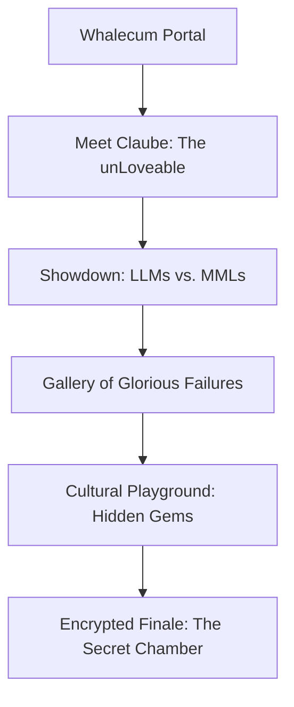

# prompt.FaiL — Project Planning Document

## Vision
Create an immersive, playful, technically sophisticated digital experience exploring the contrast between Loveable Language Models (LLMs) and Mutant Misfit Losers (MMLs), centered around Claube, the unLoveable anti-hero. The site will blend sharp British wit with layered encrypted content, all within a maintainable, scalable architecture.

---

## Architecture Overview

---

## Key Features

- **Multi-section, scroll-driven React app**
- **Contrasting LLMs and MMLs with annotated outputs**
- **Profile of Claube as the archetypal unLoveable MML**
- **Failure gallery with metadata overlays**
- **Embedded encrypted references and terminology substitutions**
- **Dry, sharp British wit surfaced contextually**
- **Obsidian/neon visual theme with smooth animations**
- **Fully responsive, accessible design**

---

## Technical Stack

- **Frontend:** React
- **Animations:** Framer Motion or GSAP
- **Scroll:** CSS Scroll Snap
- **Visual Effects:** SVG filters, CSS blend modes
- **Containerization:** Docker
- **Version Control:** Git + Gitflow
- **CI/CD:** Automated pipelines
- **Testing:** Unit tests for all features
- **Security:** Environment variables, no hardcoded secrets
- **Monitoring:** Logging, error tracking, performance metrics

---

## Guidelines & Constraints

- **File Size:** All files <500 lines
- **Documentation:** Inline comments + markdown docs
- **Security:** No sensitive data hardcoded
- **Golden Rules:** Follow Universal Project Guidelines strictly
- **Refactoring:** Continuous improvement
- **Accessibility:** WCAG compliant
- **Performance:** Optimized for speed and responsiveness

---

## Milestones

1. **Setup & Scaffolding**
2. **Implement Gateway & Navigation**
3. **Develop Claube Profile Module**
4. **Build LLM vs. MML Comparison Module**
5. **Create Failure Gallery**
6. **Add Cultural Playground & Encryption Layers**
7. **Finalize Encrypted Finale**
8. **Testing & Optimization**
9. **Documentation & Deployment**

---

## Notes

- Maintain a playful tone with embedded wit, but ensure technical precision.
- Use modular, testable components.
- Track all tasks and progress in `TASK.md`.
- Continuously review and refine based on feedback.